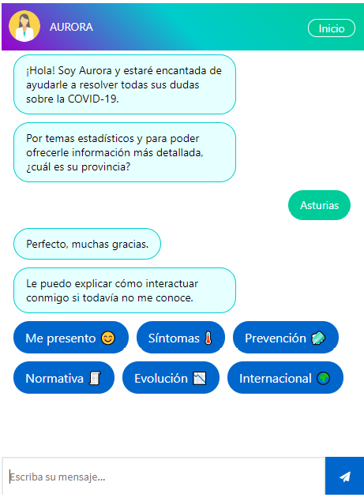

# Chatbot COVID-19: Frontend

AURORA is a chatbot that understands and answers questions (in Spanish) about the COVID-19: symptoms, prevention, regulation, the situation in Spain.
Don't hesitate to chat with [AURORA!](https://d3g60fts6ncstu.cloudfront.net/)

  

## Motivation

In March 2020, a virus appeared to seriously threaten our health. These were days of widespread confusion, uncertainty, and doubt. The infoxication or generation of many answers to these doubts by the media and social networks (many of which turned out to be false) caused even more unrest in the Spaniards.

At that precise moment, the idea of developing this chatbot was born to generate certainties and a sense of control in the citizens based on truthful information from the Ministry of Health.

With AURORA, a virtual assistant that solves doubts about the COVID-19, it is intended that citizens exercise control over what is in their hands to protect themselves and their loved ones. 

## Technologies

The frontend of the chatbot was developed using:

- Angular

- Amazon CloudFront

- Amazon S3

## Angular CLI

This project was generated with [Angular CLI](https://github.com/angular/angular-cli) version 8.1.2.

### Development server

Run `ng serve` for a dev server. Navigate to `http://localhost:4200/`. The app will automatically reload if you change any of the source files.

### Code scaffolding

Run `ng generate component component-name` to generate a new component. You can also use `ng generate directive|pipe|service|class|guard|interface|enum|module`.

### Build

Run `ng build` to build the project. The build artifacts will be stored in the `dist/` directory. Use the `--prod` flag for a production build.

### Running unit tests

Run `ng test` to execute the unit tests via [Karma](https://karma-runner.github.io).

### Running end-to-end tests

Run `ng e2e` to execute the end-to-end tests via [Protractor](http://www.protractortest.org/).

### Further help

To get more help on the Angular CLI use `ng help` or go check out the [Angular CLI README](https://github.com/angular/angular-cli/blob/master/README.md).

## CloudFront
First you have to build the project and create an Amazon S3 Bucket with the 22 files of `dist/`. Set Permissions/Block public access to OFF. Then in the Overview select all the files and Actions/Make public.

To create a [CloudFront](https://docs.aws.amazon.com/AmazonCloudFront/latest/DeveloperGuide/distribution-web-creating-console.html) web distribution:

Sign in to the AWS Management Console and open the [CloudFront console](https://console.aws.amazon.com/cloudfront/).

Choose Create Distribution.

Select a delivery method: in the Web section, choose Get Started.

Specify settings for the distribution:

- Origin Domain Name. The DNS domain name of the Amazon S3 bucket from which you want CloudFront to get objects for this origin, for example, *awsexamplebucket.s3.us-west-2.amazonaws.com*

- Origin ID: default.

- Restrict Bucket Access: YES. Create a New Identity. Yes, Update Bucket Policy.

- Default Root Object: index.html

- Create Distribution.

- Wait till the value of the Status column for your distribution changes from InProgress to Deployed.

- The CloudFront url is the Domain Name in the General tab of the distribution.

## New project
If you clone this repository, you have to update the following:

- Title and favicon in **index.html**

- Favicon in **assets/**

- Url of dialogflow-client AWS Lambda in **chat.service.ts**

- OnInit and error messages in **chat-dialog.component.ts**

- Name and favicon in **chat-dialog.component.html**

- Style in **chat-dialog.component.css**

## Gracias
